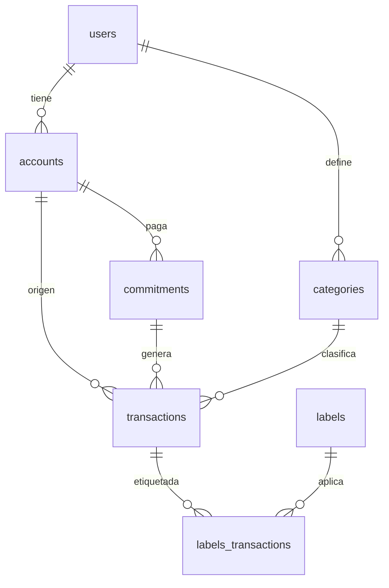

# PatoFinanzas

Bot de Telegram que registra gastos en lenguaje natural y calcula cuánto debes pagar de cada tarjeta de crédito antes del vencimiento.


## El problema

Las apps de gastos tratan cada compra igual. Pero pagar con tarjeta de crédito **no** es lo mismo que pagar en efectivo: con tarjeta no sale dinero hoy, se crea una deuda que se cobra semanas después.

Eso genera dos preguntas que ninguna app gratuita responde bien:

- ¿Cuánto tengo que pagar de esta tarjeta en el próximo vencimiento?
- ¿Mis ingresos del mes cubren todo lo que debo pagar?

PatoFinanzas modela el **ciclo de facturación** (fecha de cierre y fecha de vencimiento) para responderlas con datos reales.

## Qué hace

- **Registro en lenguaje natural.** Escribes `almuerzo 15 con la latam` y un LLM extrae monto, categoría, cuenta y fecha.
- **Deuda del ciclo.** `/deuda` calcula lo que debes pagar sumando solo las compras del ciclo cerrado.
- **Multi-cuenta.** Débito, efectivo y N tarjetas, cada una con su propio cierre y vencimiento.
- **Compromisos recurrentes.** Alquiler, suscripciones y compras en cuotas, con o sin número de cuotas.
- **Etiquetas de contexto.** Cada gasto se clasifica en tres dimensiones (con quién, por qué, dónde) además de su categoría.

## Decisiones de diseño

| Decisión | Razón |
|---|---|
| Pagar la tarjeta es una **transferencia**, no un gasto | Registrarlo como gasto contaría la misma compra dos veces |
| Categoría única + etiquetas múltiples | Una compra solo se gasta una vez: si una categoría se solapa con otra, el reporte suma más de 100% |
| El saldo y las cuotas restantes **no se guardan** | Son datos derivados: se calculan desde las transacciones, así no pueden desincronizarse |
| `DECIMAL`, nunca `FLOAT`, para montos | `FLOAT` guarda aproximaciones; con dinero eso es inaceptable |
| La lógica del ciclo vive en Postgres | Es una función (`deuda_tarjeta`) llamada vía RPC: el cálculo queda junto al dato |

## Arquitectura

```
patofinanzas/
├── main.py              # punto de entrada
├── config.py            # claves y constantes
├── clients.py           # instancias de Telegram, Supabase y el LLM
├── web.py               # servidor keep-alive
├── services/            # acceso a datos — nunca responde por Telegram
│   ├── catalogs.py
│   ├── expenses.py
│   └── debt.py
├── ai/                  # extracción con LLM
│   ├── prompts.py
│   └── extractor.py
└── handlers/            # capa de Telegram — nunca escribe SQL
    ├── auth.py
    ├── commands.py
    ├── callbacks.py
    └── messages.py
```

Las dependencias van en una sola dirección: `handlers → services/ai → clients → config`.

## Modelo de datos



- **accounts** — `closing_day` y `due_day` como enteros, no fechas: el ciclo se repite cada mes.
- **transactions** — `id_account` (origen) e `id_account_destination` (destino). Un gasto solo usa origen; un ingreso solo destino; un pago de tarjeta usa ambos.
- **commitments** — pagos recurrentes. `total_installments` vacío significa indefinido.

## Stack

- **Python** · pyTelegramBotAPI · Flask
- **Supabase** (PostgreSQL) con Row Level Security activado
- **LLM** para extracción de entidades, con salida JSON estructurada

## Instalación

```bash
git clone https://github.com/<tu-usuario>/patofinanzas.git
cd patofinanzas
python -m venv .venv && source .venv/bin/activate
pip install -r requirements.txt
```

Crea las tablas y carga los datos base:

```bash
# En el SQL Editor de Supabase, en este orden:
# 1. schema.sql
# 2. seed.sql
```

Configura las variables de entorno (o un `env.py` local, ignorado por git):

```
TELEGRAM_TOKEN=...      # de @BotFather
SUPABASE_URL=...
SUPABASE_KEY=...        # service_role
GOOGLE_API_KEY=...
MY_USER_ID=...          # tu id de Telegram
```

```bash
python main.py
```

## Limitaciones conocidas

- **Privacidad del LLM.** Los prompts incluyen descripciones de gastos reales. El free tier de varios proveedores permite usar esos datos para entrenar. Para uso serio, conviene un proveedor con opt-out o un modelo local.
- **Un solo usuario.** El bot valida que el remitente sea el dueño; no hay multi-tenancy.
- **Categorización imperfecta.** El LLM a veces clasifica mal un gasto ambiguo. Es corregible con un UPDATE, pero todavía no desde el bot.
- **Etiquetado por reglas.** El histórico se etiquetó con patrones sobre la descripción, no caso por caso.

## Roadmap

- [ ] Comando `/ingreso` y edición del último movimiento
- [ ] Recordatorio automático 3 días antes de cada vencimiento
- [ ] Dashboard en Power BI sobre la misma base
- [ ] Registro desde captura de pantalla de la notificación del banco (OCR)
- [ ] Migración al SDK compatible con OpenAI para poder cambiar de proveedor sin tocar código

## Licencia

MIT